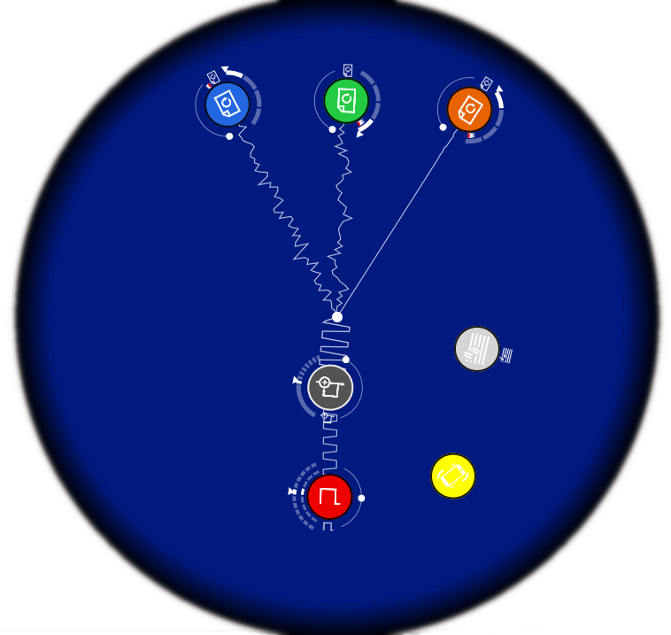

# soundtable

A vibe-coded [Reactable](https://reactable.com/) clone app for Linux.

Based on [JUCE Framework](https://juce.com/), [Fluidsynth](https://www.fluidsynth.org/), [reacTIVision](https://reactivision.sourceforge.net/) + [OpenCV](https://opencv.org/).

  

- Supports TUIO 1.1 (OSC `UDP/3333`) and works with TUIO Simulator
- Use fiducials with your camera (`tracker`)
- Load sessions from [Reactable Community](http://community.reactable.com/community/) (`.rtz` files)

> [!IMPORTANT]
> Implementation is still work in progress.

## History

Like any other fan of Reactable, I was amazed with the [psychosynth](https://github.com/arximboldi/psychosynth) project years ago, but it seemed to not gain enough attraction.
And the Reactable Mobile application sure was very entertaining, but it misses the physical part of handling the controls with your hands and not your fingers. 

Also I don't have the money or space to keep that huge table in my house, but still I'd love to play it some time.

So while talking to a friend recently, we discussed that LLMs were a thing and nowadays are working good enough, I thought about what project could I try to make... And so this idea came to my mind. 

### Copyright

Reactable content and materials are trademarks and copyrights of Reactable Systems or its licensors. All rights reserved.

Soundtable project is not affiliated with Reactable or its licensors.
